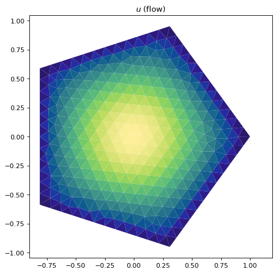

# What is this?

This is a collection of scripts aimed at implementing a framework 
for doing simulations and analyzing summary statistics relating 
to passive tracers in Poiseuille flow. I'm using the 
FiPy finite element library to implement the essential tools.

# Why do this?
My previous project relating to this, "skewtools," 
(see https://github.com/maminian/skewtools ) is a mix of 
Fortran and Python code for simulating passive tracers in 
infinite tubes/channels with fixed flow and cross-section. 
This framework can (and has been) 
extended with at least a moderate amount of effort to 
more exotic cross section, *but* you need to (a) have an implicit 
representation of the domain as the zero level set of a 
function, and (b) you need an explicit formula for the flow, 
in terms of a subroutine that can do a lookup on a rectangular 
grid, or as an exact formula. A few more details are needed, 
but they're closely related to these two requirements.

For example, with a circular cross section, the boundary can 
be implicitly described as the zero level set of 
the function f(y,z) = 1 - y**2 - z**2. The interior is 
wherever f(y,z) > 0. In this case (and most cases we've dealt 
with) this function also is proportional to, if not exactly, 
the formula for the fluid flow itself, which has zero Dirichlet 
boundary conditions. 

We've worked around these constraints in previous papers by 
extending known flow geometries/solutions by harmonic perturbations, 
but this is going to be an approach that's limited, when it 
comes down to it. The long term goal of this repository is 
to allow one to specify an arbitrary cross section 
(possibly by interactive drawing) and automate the pipeline 
to creating a mesh, solving for the flow, functions 
relating to asymptotic predictions, and allow for 
numerical simulation using the finite element flow solution.

# Requirements

* python 3
* FiPy (see https://www.ctcms.nist.gov/fipy/)
* Gmsh (see http://gmsh.info/ ; you may need to add it to your default $PATH for fipy to recognize it)
* numpy
* matplotlib >= 3.0
* Optional: cmocean (only for a few extra colormaps)

# Getting started
* Study and try running `fipy_polys.py`. This is an example where I've parameterized the boundary of the cross-section by a collection of points. The meshing is handled by the module gen_mesh, and this is passed on to fipy to solve the Poisson problem for the flow, which is visualized using fipy's default Visualizer() class.

